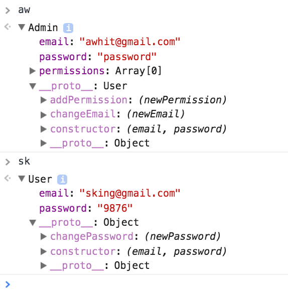

# OOJS - Classes and Inheritance
*by Andrew Whitley*

## Learning Objectives
- Understand the advantages of object-oriented JavaScript
- Create and instantiate object prototypes using the `class` declaration and `new` keyword
- Create classes that inherit properties and behavior from one another using the `extends` and `super` keywords

## Framing
Thus far, we have been constructing object literals as a way to make our code more modular and to manage complexity. For example:

```js
let user = {
  email: 'awhit@gmail.com',
  password: 'password',
  changePassword: function(newPassword) {
    this.password = newPassword
    console.log(`password changed to ${this.password}`)
  }
}
```

<details>
<summary><strong>Observations </strong></summary>

  > * Our object groups together relevant data and methods
  > * There are fewer global variables.
  > * Our code is not very reusable / flexible ( i.e. what if we need there to be multiple users? ).

</details>

If we wanted to have multiple users in our application, using this method, we would have to manually construct object literals for each user.

```js
let user = {
  email: 'awhit@gmail.com',
  password: 'password',
  changePassword: function(newPassword) {
    this.password = newPassword
    console.log(`password changed to ${this.password}`)
  }
}
let user2 = {
  email: 'sking@gmail.com',
  password: '9876',
  changePassword: function(newPassword) {
    this.password = newPassword
    console.log(`password changed to ${this.password}`)
  }
}
```
Obviously this is not a sustainable approach nor does it keep our code DRY (Don't Repeat Yourself). Instead we should use JavaScript "classes" (prototypes) to create many "instances" of a user object.

## What is a class (prototype)?

- A **class** is first and foremost a function that returns an object encapsulating related properties and methods.
- A class is NOT the same thing as an object. We refer to an object created by a class as an **instance** of the class.
- A simple way to think about classes is that they are abstract **blueprints** for the objects they produce. In this example, not all users will have the same email and password, but will all have those same properties and the related changePassword method.

### Pre-ES6 Syntax

Before the release of ES6, there was no `class` keyword available and instead we used prototypes. We could rewrite the structure of the above object literals into prototypes as such:
```js
function User (email, password) {
  this.email = email
  this.password = password
}
User.prototype.changePassword = function (newPassword) {
   this.password = newPassword
   console.log(`Password changed to ${this.password}`)
}
```
To instantiate an object using this prototype definition, we would use the `new` keyword to call the prototype constructor and feed it the relevant data for that **instance** of a User:
```js
aw = new User('awhit@gmail.com', 'password')
sk = new User('sking@gmail.com', '9876')
```
As you can see, a class (prototype) is simply a function that allows developers to use the advantages of OOJS while maintaining DRYness.

### ES6 Syntax

With the release of ES6 in 2015, developers were given the `class` keyword to achieve the above functionality in a more readable and clear syntax. We could rewrite the prototype above as a class in the following way:
```js
class User {
  constructor(email, password) {
    this.email = email
    this.password = password
  }
  changePassword(newPassword) {
    this.password = newPassword
  }
}
```
As you can see, in the class syntax, the constructor function is explicitly named and methods are grouped in with the constructor. However, under the hood, it is doing the exact same operations as before. To instantiate objects using this class definition, we use the same `new` keyword and syntax as before:
```js
aw = new User('awhit@gmail.com', 'password')
sk = new User('sking@gmail.com', '9876')
```

By using a class to create our objects, we are able to create many user objects that have different data but identical properties. However, what if we need to create different **types** of users (such as standard users vs administrators). One solution would be to create a class for each:

```js
class User {
  constructor(email, password) {
    this.email = email
    this.password = password
  }
  changePassword(newPassword) {
    this.password = newPassword
  }
}

class Admin {
  constructor(email, password) {
    this.email = email
    this.password = password
    this.permissions = []
  }
  changePassword(newPassword) {
    this.password = newPassword
  }
  changeEmail(newEmail) {
    this.email = newEmail
  }
  addPermission(newPermission) {
    this.permissions.push(newPermission)
  }
}
```
<details>
<summary><strong>Observations </strong></summary>

  > * While this while allow us to have different kinds of users, it is not very DRY in that both classes share many of the same properties and methods
  > * The solution for this is to use class **inheritance** to allow one class to inherit properties and methods from another

</details>

## Inheritance

### What is inheritance?

- Inheritance is the process of one class inheriting the functionality (i.e. the properties and methods) of another class.
- It can be used to make your code more DRY so that a slight variation on an existing class does not have to be redefined from scratch.
- In our example, an Admin is a specific **type** of User. As such, the Admin class will need to **inherit** the more general properties and methods of the User class and add some extra ones to it.

```js
class User {
  constructor(email, password) {
    this.email = email
    this.password = password
  }
  changePassword(newPassword) {
    this.password = newPassword
  }
}

class Admin extends User {
  constructor(email, password) {
    super(email, password)
    this.permissions = []
  }
  changeEmail(newEmail) {
    this.email = newEmail
  }
  addPermission(newPermission) {
    this.permissions.push(newPermission)
  }
}

aw = new Admin('awhit@gmail.com', 'password')
sk = new User('sking@gmail.com', '9876')

```
To have Admin inherit from User:

1. Use the `extends` keyword to define the Admin class as a child class of the User class
1. Ensure there are no duplicate methods or properties on the Admin class (only ones that are being **added**)
1. Use the `super()` method in the Admin class' constructor function to call its parent class' constructor

When we test these in the browser console, we can see that the Admin class includes all of the methods and properties of the User class while adding its own Admin-specific ones.



Bonus: What do you think will happen if a child class has a duplicate method?
